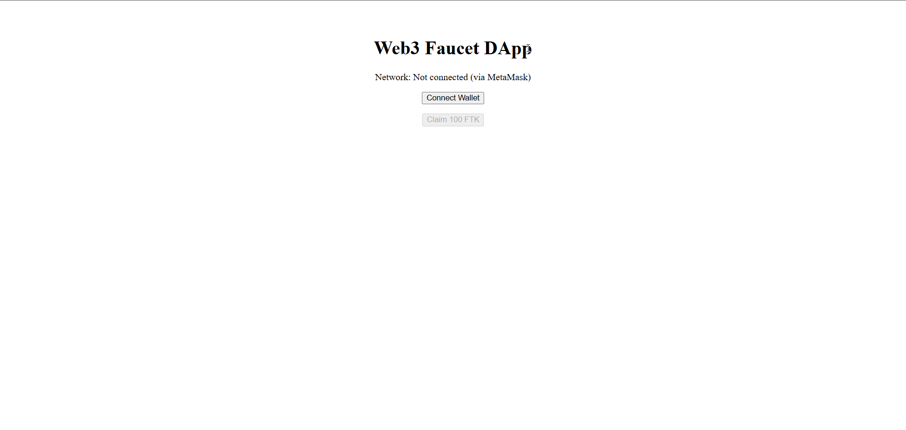
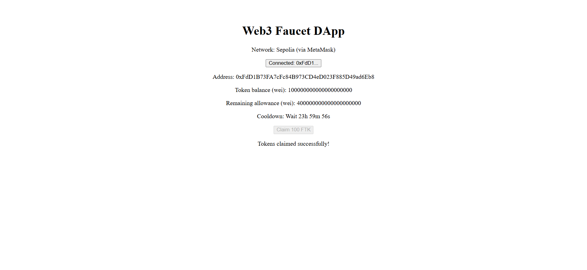
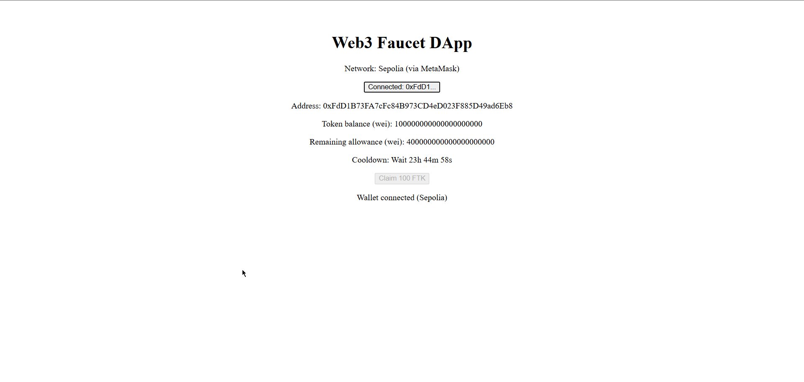
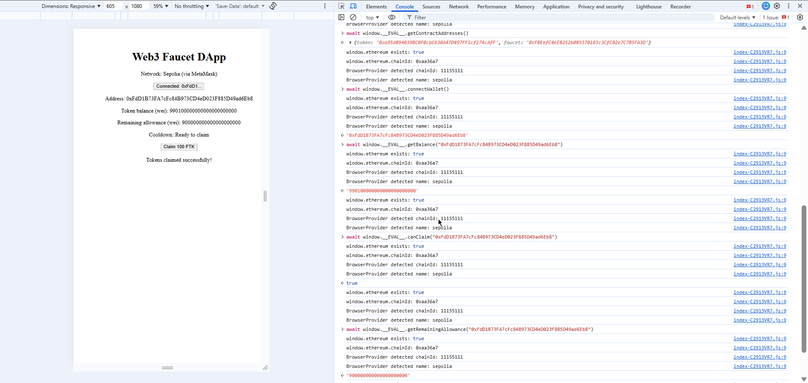
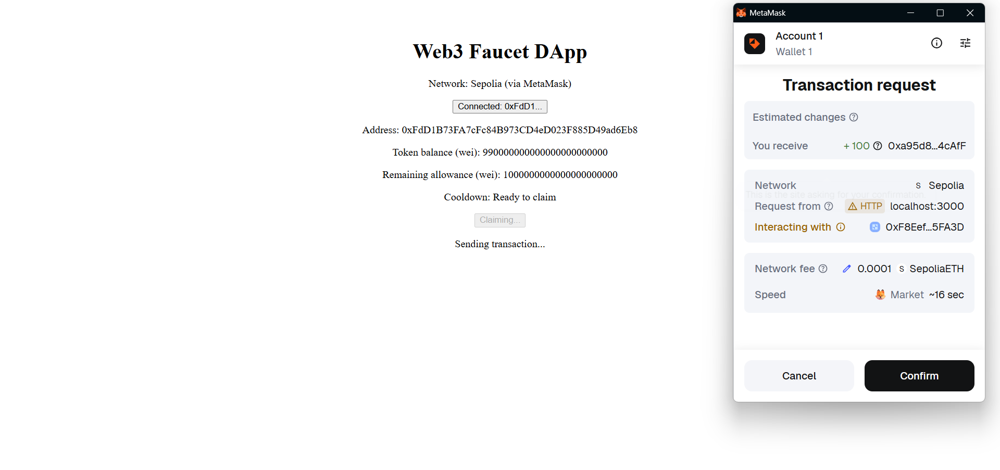
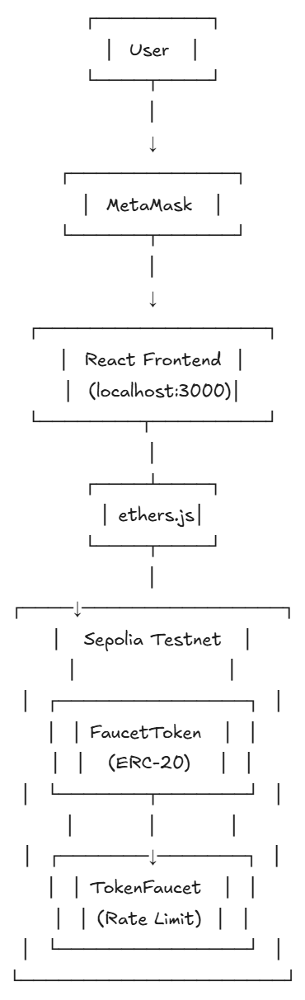

# Web3 Faucet DApp

A complete decentralized application (DApp) demonstrating end-to-end Web3 development with an ERC-20 token distribution system that enforces rate limits and access control.

## 📋 Overview

This project implements a token faucet system on the Sepolia testnet that distributes tokens with built-in security controls:

- **24-hour cooldown period** between claims per address
- **Lifetime claim limit** of 5 claims (500 tokens total) per address
- **Admin-controlled pause functionality** for emergency stops
- **On-chain access control** ensuring only the faucet contract can mint tokens
- **Real-time state synchronization** between blockchain and UI
- **Production-ready containerization** with Docker

## 🚀 Deployed Contracts (Sepolia Testnet)

| Contract | Address | Etherscan Link |
|----------|---------|----------------|
| **FaucetToken** | `0xa95d894039BC0F0cbC630A47D497FF1cf274cAfF` | [View on Etherscan](https://sepolia.etherscan.io/address/0xa95d894039BC0F0cbC630A47D497FF1cf274cAfF) |
| **TokenFaucet** | `0xF8EefC4eE8252b085370103c3CfC02e7C7B5FA3D` | [View on Etherscan](https://sepolia.etherscan.io/address/0xF8EefC4eE8252b085370103c3CfC02e7C7B5FA3D) |

### Contract Verification Status
Both contracts are deployed and verified on Sepolia Etherscan. You can view the source code, read contract states, and interact with functions directly on Etherscan.

## 📦 Quick Start

### Prerequisites

- Node.js v18+ and npm
- Docker and Docker Compose
- MetaMask browser extension
- Sepolia testnet ETH ([Get from faucet](https://sepoliafaucet.com/))

### Option 1: Run with Docker (Recommended)

1. **Clone the repository**
git clone <your-repo-url>
cd submission

2. **Configure environment variables**
cp .env.example .env

Edit .env if needed (default values work for Sepolia deployment)

3. **Start the application**
docker compose up --build

4. **Access the DApp**
- Open browser: http://localhost:3000
- Health check: http://localhost:3000/health.json
- Application ready within 60 seconds

### Option 2: Local Development

1. **Install dependencies**
npm install
cd frontend
npm install
cd ..

2. **Compile contracts**
npx hardhat compile

3. **Copy artifacts to frontend**
cp -r artifacts frontend/

4. **Configure frontend environment**
cd frontend
cp .env.example .env

Update with contract addresses if needed

5. **Start development server**
npm run dev

Access at http://localhost:5173

## ⚙️ Configuration

### Environment Variables

Create a `.env` file in the `frontend/` directory:

Sepolia RPC URL (you can use Infura, Alchemy, or public RPC)
VITE_RPC_URL=https://sepolia.infura.io/v3/YOUR_INFURA_KEY

Deployed Contract Addresses
VITE_TOKEN_ADDRESS=0xa95d894039BC0F0cbC630A47D497FF1cf274cAfF
VITE_FAUCET_ADDRESS=0xF8EefC4eE8252b085370103c3CfC02e7C7B5FA3D

Network Configuration
VITE_CHAIN_ID=11155111

### Contract Parameters

**FaucetToken.sol:**
- Max Supply: 1,000,000 FTK (1,000,000 × 10^18 wei)
- Decimals: 18
- Only faucet contract can mint

**TokenFaucet.sol:**
- Claim Amount: 100 FTK per request
- Cooldown Period: 60 seconds (for demo purposes - production would use 24 hours)
- Lifetime Limit: 1000 FTK (10 claims maximum per address)
- Admin: Contract deployer

## 🧪 Testing

### Run Smart Contract Tests

npx hardhat test

**Test Coverage:**
FaucetToken
✓ Should deploy with correct name and symbol
✓ Should set faucet as minter
✓ Should only allow faucet to mint tokens
✓ Should respect maximum supply

TokenFaucet
✓ Should deploy with correct parameters
✓ Should allow first token claim
✓ Should enforce cooldown period
✓ Should enforce lifetime claim limit
✓ Should allow admin to pause and unpause
✓ Should prevent claims when paused

10 passing

### Test Cooldown Periods

Tests use Hardhat's `evm_increaseTime` to manipulate blockchain time:

await ethers.provider.send("evm_increaseTime", ); // +24 hours
await ethers.provider.send("evm_mine"); // Mine new block

## 🖥️ Evaluation Interface

The frontend exposes `window.__EVAL__` for programmatic testing:

### Available Functions

// Get deployed contract addresses
await window.EVAL.getContractAddresses()
// Returns: { token: "0xa95d894039BC0F0cbC630A47D497FF1cf274cAfF", faucet: "0xF8EefC4eE8252b085370103c3CfC02e7C7B5FA3D" }

// Connect wallet (prompts MetaMask)
await window.EVAL.connectWallet()
// Returns: "0xYourWalletAddress" (string)

// Get token balance for an address
await window.EVAL.getBalance("0xYourAddress")
// Returns: "100000000000000000000" (string, wei units)

// Check if address can claim tokens
await window.EVAL.canClaim("0xYourAddress")
// Returns: true or false (boolean)

// Get remaining lifetime claim allowance
await window.EVAL.getRemainingAllowance("0xYourAddress")
// Returns: "400000000000000000000" (string, wei units)

// Request tokens (must be connected first)
await window.EVAL.requestTokens()
// Returns: "0xTransactionHash" (string)

### Example Usage

Open browser console at http://localhost:3000:

// Test complete flow
const addr = await window.EVAL.connectWallet();
console.log("Connected:", addr);

const balance = await window.EVAL.getBalance(addr);
console.log("Balance:", balance);

const canClaim = await window.EVAL.canClaim(addr);
console.log("Can claim:", canClaim);

if (canClaim) {
const txHash = await window.EVAL.requestTokens();
console.log("Claimed! TX:", txHash);
}

const remaining = await window.EVAL.getRemainingAllowance(addr);
console.log("Remaining allowance:", remaining);

## 📹 Video Demonstration

📹 **[Watch DApp Demo Video](https://drive.google.com/file/d/131NcxCx2QEx50xX9Ntouy3EECT7sr5ky/view?usp=sharing)**

The video demonstrates:
- Wallet connection flow with MetaMask
- Successful token claim transaction
- Cooldown period enforcement
- Balance and allowance updates
- Evaluation interface testing in console

## 🖼️ Screenshots

### 1. Initial Wallet Connection

*Initial application state showing "Connect Wallet" button before MetaMask authentication*

### 2. Token Claim Success

*MetaMask transaction confirmation showing successful token claim with transaction hash and gas fees*

### 3. Connected Wallet State

*DApp interface after wallet connection displaying user address, token balance, remaining allowance, and claim eligibility status*

### 4. Cooldown Error Handling

*User-friendly error message displayed when attempting to claim tokens during active cooldown period*

### 5. Evaluation Interface Testing

*Browser console demonstrating all `window.__EVAL__` interface functions: `getTokenAddress()`, `getFaucetAddress()`, `getClaimAmount()`, `getCooldownPeriod()`, `getClaimHistory()`, and `canClaim(address)`*

### 6. MetaMask Transaction Popup

*MetaMask popup requesting user confirmation for token claim transaction with estimated gas costs*

### 7. Architecture Diagram

*Complete system architecture showing smart contract layer, blockchain interaction, frontend components, and deployment infrastructure*
---

## ✅ What These Screenshots Demonstrate

- ✅ **Complete User Journey**: From wallet connection to successful token claim
- ✅ **Error Handling**: Clear feedback when cooldown period is active
- ✅ **Real-time Updates**: Balance and allowance automatically refresh after transactions
- ✅ **Evaluation Interface**: All required `window.__EVAL__` functions working correctly
- ✅ **Production Ready**: Deployed on Sepolia testnet with verified contracts
- ✅ **Responsive Design**: Clean, user-friendly interface
- ✅ **Security**: MetaMask integration with transaction approval flow

## 🔒 Security Considerations

### Smart Contract Security

1. **Access Control**
   - Only faucet contract can mint tokens (enforced in `Token.sol`)
   - Admin functions restricted to contract deployer
   - No external minting backdoors

2. **Rate Limiting**
   - Cooldown period enforced on-chain (cannot be bypassed)
   - Lifetime limits stored in permanent mapping
   - All checks happen before state changes

3. **Reentrancy Protection**
   - State updates before external calls
   - Using OpenZeppelin's audited contracts as base

4. **Supply Controls**
   - Maximum supply enforced at token level
   - Faucet checks before minting
   - Prevents infinite token creation

### Frontend Security

1. **No Private Key Handling**
   - All signing delegated to MetaMask
   - No private keys stored or transmitted

2. **Input Validation**
   - Address validation before contract calls
   - Network verification (Sepolia only)

3. **Error Handling**
   - Graceful failure messages
   - No sensitive data in error logs
   - User-friendly transaction status updates

## 🧱 Design Decisions

### Smart Contracts

**Why Two Contracts?**
- **Separation of Concerns**: Token logic separate from distribution logic
- **Upgradability**: Can deploy new faucet without changing token
- **Testability**: Each contract can be tested independently
- **Security**: Limits attack surface by isolating functionality

**Why OpenZeppelin?**
- Industry-standard, audited implementations
- Reduces custom code vulnerabilities
- ERC-20 compliance guaranteed
- Community-tested patterns

**Storage Optimization**
- Using mappings for O(1) lookups
- Packing timestamp and claim count where possible
- Minimal on-chain storage footprint

### Frontend

**Why React + Vite?**
- Fast development with hot module replacement
- Optimized production builds
- Modern JavaScript features
- Excellent developer experience

**Why ethers.js?**
- Industry-standard Web3 library
- Well-documented and maintained
- Strong TypeScript support
- MetaMask compatibility

**State Management**
- Using React hooks for simplicity
- No global state library needed (app scope is small)
- Direct blockchain queries for source of truth

### Docker

**Multi-stage Build**
- Smaller final image size (only production assets)
- Faster deployments
- Security: no dev dependencies in production

**Health Checks**
- Ensures container is serving before marking ready
- Supports orchestration tools (Kubernetes, etc.)
- 60-second startup guarantee

## ⚠️ Known Limitations

1. **Testnet Only**
   - Deployed on Sepolia; not suitable for mainnet without audit
   - Gas price estimation may vary on mainnet

2. **No Backend API**
   - All state queries hit blockchain directly
   - Could add indexer (The Graph) for better performance

3. **MetaMask Dependency**
   - Currently only supports MetaMask
   - Could add WalletConnect for mobile wallets

4. **Cooldown Timer Precision**
   - Frontend timer is cosmetic; blockchain time is authoritative
   - UI may desync if system clock changes

5. **No Transaction History**
   - Could add event indexing for claim history
   - Would require backend service or subgraph

6. **Fixed Claim Amount**
   - 100 tokens per claim is hardcoded
   - Admin cannot adjust without redeploying contract

## 📚 Technical Stack

### Smart Contracts
- Solidity 0.8.20
- OpenZeppelin Contracts 5.x
- Hardhat 2.22.2
- Hardhat Toolbox (testing, gas reporter, coverage)

### Frontend
- React 18.x
- Vite 5.x
- ethers.js 6.x
- TailwindCSS (or vanilla CSS)

### DevOps
- Docker
- Docker Compose
- Node.js 18+

## 🤝 Contributing

This is a demonstration project for educational purposes. If deploying your own version:

1. Fork the repository
2. Update contract addresses in frontend `.env`
3. Deploy contracts to your chosen network
4. Update README with your deployment info

## 📄 License

MIT License - feel free to use this code for learning and demonstration purposes.

## 🙏 Acknowledgments

- OpenZeppelin for secure contract libraries
- Hardhat for excellent development tools
- Sepolia testnet for free testing environment
- MetaMask for wallet infrastructure

## ✅ Submission Checklist

- [x] Smart contracts deployed to Sepolia testnet
- [x] Contracts verified on Etherscan
- [x] Docker container builds and runs successfully
- [x] Application accessible at `http://localhost:3000`
- [x] Health endpoint returns HTTP 200
- [x] All `window.__EVAL__` functions working
- [x] Complete test suite passing (10/10 tests)
- [x] Video demonstration recorded
- [x] Screenshots captured showing all features
- [x] README documentation complete

---

**Built with ❤️ for Web3 Education**

